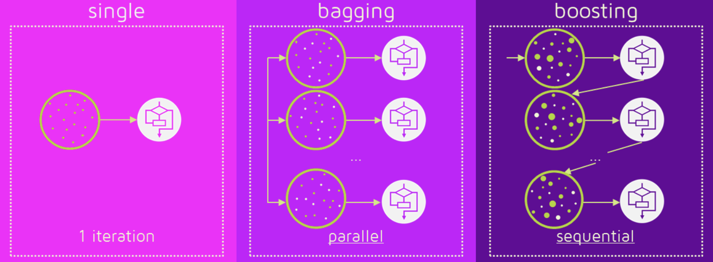

# 앙상블(Ensemble)
- 여러 개의 결정 트리(Decision Tree)를 결합하여 하나의 결정 트리보다 더 좋은 성능을 내는 머신러닝
- 여러 개의 약한 모형(Weak Learner)를 결합하여 강한 모형(Strong Learner)를 만드는 것
- 종류

    - 배깅(Bagging)
    - 부스팅(Boosting)

## 배깅(Bagging/Bootstrap Aggregation)
- 샘플을 여러 번 뽑아(Bootstrap) 각 모델을 독립적으로 학습시켜 결과물을 집계(Aggregation)
- 집계 방식
    - 범주형 데이터: 다수결
    - 수치형 데이터: 평균
- 예시
    - 랜덤 포레스트

## 부스팅(Boosting)
- 처음 모델이 예측을 하면 그 예측 결과에 따라 데이터에 가중치가 부여되고, 부여된 가중치가 다음 모델에 영향(오차가 크거나 잘못 분류된 데이터는 가중치를 높여주고 오차가 작거나 잘 분류된 데이터는 가중치를 낮추어주는 과정을 반복해서 다음 모델에서 제대로 예측하지 못한 데이터에 대해 더 집중하도록 유도)
- 장점
    - 성능이 일반적으로 더 좋음
- 단점
    - 학습 속도 느림
    - 오버 피팅 가능성 높음
- 결론
    - 개별 결정 트리의 성능이 낮을 때 적합
